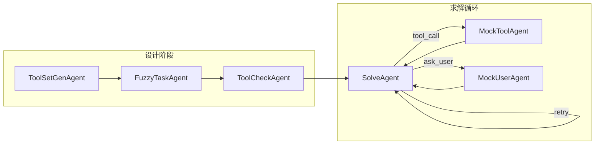

# TraceSynth

TraceSynth 是一个面向 **Agentic RAG（智能体检索增强生成）** 的合成数据生成框架。它基于 LangGraph 编排多智能体流水线，从种子 persona 出发，自动设计虚拟 RAG 工具集、构造评测任务、模拟工具调用与用户交互，最终产出可用于训练或评测 Agentic RAG 系统的多轮工具调用轨迹。

## 核心能力

- **6 步 Agentic RAG 流程对齐**：覆盖检索前优化 → 检索 → 检索后优化 → 相关性评估与迭代 → 最终回答
- **多智能体协作**：工具设计、任务模糊化、工具审核、求解、工具模拟、用户模拟分工明确
- **可配置复杂度**：工具数量、自定义组件、干扰工具、迭代轮次均可调节
- **三层容错**：API 退避重试、LLM 输出解析重采样、Solver 非法 tool_call 自纠错
- **并发批处理**：支持 JSONL / HuggingFace datasets 多源输入，断点续跑

## Agentic RAG 六步流程

除 step1（用户 Query）和 step6（最终输出）外，step2~step5 每一步均抽象为可调用工具：

| 步骤 | 名称 | 工具类别 | 示例 |
|------|------|----------|------|
| step1 | 用户 Query 输入 | — | 接收原始检索/问答请求 |
| step2 | 检索前优化 | Query_Optimization_Tools | Query 重写、HyDE、Step-back |
| step3 | 检索 | Retrieval_Tools | BM25、向量检索、知识图谱 |
| step4 | 检索后优化 | Post_Retrieval_Tools | 去重、融合、Rerank、精炼（合并为一步） |
| step5 | 相关性评估与迭代 | Evaluation_Tools | 完备性判断、缺口诊断；不足则返回 step2 |
| step6 | 输出最终结果 | — | 基于检索上下文生成 `<answer>` |

## 流水线架构



| 节点 | 职责 |
|------|------|
| `ToolSetGenAgent` | 根据 persona 背景设计 RAG 工具集、任务、约束与管道流程 |
| `FuzzyTaskAgent` | 将任务模糊化为用户口吻的 Query + 背景知识 |
| `ToolCheckAgent` | 审核/精简工具集，添加干扰工具 |
| `SolveAgent` | 按 6 步流程编排工具调用，输出最终答案 |
| `MockToolAgent` | 模拟虚拟知识库中的工具返回 |
| `MockUserAgent` | 模拟真实用户，逐步透露背景信息 |

## 项目结构

```
TraceSynth/
├── configs/
│   ├── tool_use_data_gen.yaml      # 主配置文件
│   ├── tool_use_data_gen.example.yaml
│   ├── rubrics.example.yaml        # 评分细则生成配置
│   └── persona_*.jsonl             # 种子 persona 数据
├── scripts/
│   ├── tool_use_data_gen.py        # 数据合成入口
│   ├── rubrics.py                  # 评分细则生成
│   └── solve_task.py
├── tracesynth/
│   ├── configuration.py            # 模型配置 & 合成复杂度
│   ├── functions/
│   │   ├── prompt.py               # 全部提示词模板
│   │   ├── call_llms.py            # LLM 调用 & 重试
│   │   ├── tool_set_gen.py         # 工具集生成
│   │   ├── fuzzy_task.py           # 模糊任务生成
│   │   ├── tool_check.py           # 工具审核
│   │   ├── solve_task.py           # 求解一步
│   │   ├── mock_tools.py           # 工具模拟
│   │   └── mock_user.py            # 用户模拟
│   └── graph/
│       └── graph_virtual_tools.py  # LangGraph 流水线
├── tests/
│   ├── test_6step_prompts.py       # 提示词占位符冒烟测试
│   └── test_retry_resilience.py    # 重试机制单元测试
└── output/                         # 默认输出目录
```

## 快速开始

### 1. 安装依赖

```bash
pip install -r requirements.txt
```

### 2. 配置 API 密钥

在项目根目录创建 `.env` 或 `.local.env`，填入所用模型对应的 API Key：

```env
DASHSCOPE_API_KEY=your_key
SILICONFLOW_API_KEY=your_key
WANLAI_API_KEY=your_key
AGNES_API_KEY=your_key
```

密钥通过 `configs/tool_use_data_gen.yaml` 中 `step_models` 各步骤的 `api_key_env` 字段引用环境变量名（**不要**将密钥直接写入 yaml）。

### 3. 准备种子数据

监督 QA 种子数据默认使用 [`data/seed_qa_sample.jsonl`](data/seed_qa_sample.jsonl)，每行一条 JSON：

```json
{
  "id": "rag-001",
  "question": "在进行创业投资时，如何确定一个项目的估值？",
  "label": "项目估值通常综合可比公司法、DCF 和最近融资轮估值等因素。",
  "context": "创业投资估值需结合行业可比标的、未来现金流预测与退出路径。"
}
```

**字段约定**

| 字段 | 必填 | 说明 |
|------|------|------|
| `question` | 是 | 规范问题字段；`query` 可作为别名 |
| `label` | 是 | 金标答案，用于约束虚拟知识库与答案校验，不暴露给 Solver |
| `context` | 否 | 参考上下文，可为字符串或字符串列表 |
| `id` | 建议 | 唯一标识；缺失时由 `question+label` 生成稳定 hash |

也支持 HuggingFace `datasets` 目录作为 `paths.data_file`；字段映射可在 yaml 的 `input` 段配置。

> **Legacy**：旧版 `configs/persona_*.jsonl`（仅 `persona` 文本）已不再作为默认输入。如需兼容，可在配置中设置 `input.legacy_persona_mode: true`（会将 persona 同时作为 question 与 label，仅用于过渡）。

### 4. 运行数据合成

```bash
python scripts/tool_use_data_gen.py --config configs/tool_use_data_gen.yaml
```

常用 CLI 参数：

```bash
# 覆盖合成复杂度
python scripts/tool_use_data_gen.py \
  --num-tools "4~6" \
  --num-custom-tools "1" \
  --distractor-tools "1~2" \
  --max-iterations "1~2"
```

## 配置说明

主配置文件 [`configs/tool_use_data_gen.yaml`](configs/tool_use_data_gen.yaml) 包含以下区块：

### step_models — 各步骤模型

为各 Agent 节点分别指定模型、API 地址、密钥环境变量、温度、max_tokens：

```yaml
step_models:
  ToolSetGenAgent:
    name: "gpt-5.4"
    api_base: "https://api.example.com/v1"
    api_key_env: "EXAMPLE_API_KEY"
    max_tokens: 10240
    temperature: 0.9
  # FuzzyTaskAgent, ToolCheckAgent,
  # PlanTrajectoryAgent, EvaluatePlanAgent, ExecutePlanAgent,
  # SolveAgent, MockToolAgent, MockUserAgent ...
```

`PlanTrajectoryAgent`、`EvaluatePlanAgent`、`ExecutePlanAgent` 分别对应规划、评估与计划执行后生成最终答案的 LLM 调用。若未在 yaml 中配置，将自动回退到 `SolveAgent` 的模型参数。

### synthesis — 合成复杂度（4 个参数）

| 参数 | 默认值 | 说明 |
|------|--------|------|
| `num_tools` | `"4~6"` | RAG 工具总数（须 ≥4 以覆盖 step2~step5） |
| `num_custom_tools` | `"1"` | 自定义虚拟组件数 |
| `distractor_tools` | `"1~2"` | ToolCheck 阶段添加的干扰工具数 |
| `max_iterations` | `"1~2"` | step5→step2 检索迭代轮次（`"0"` 表示无需迭代） |

### retry — 容错重试

| 参数 | 默认值 | 说明 |
|------|--------|------|
| `api_max_retries` | `3` | API transient errors (timeout/rate limit/5xx) total attempts, including the first call |
| `api_retry_base` | `1.0` | 指数退避基数（秒） |
| `parse_max_retries` | `2` | Extra LLM resampling attempts after output parse failure; total parse attempts are `parse_max_retries + 1` |
| `tool_call_max_retries` | `3` | Solver 非法 tool_call 自纠错次数 |

> With defaults, one `call_and_parse` can make up to `api_max_retries * (parse_max_retries + 1) = 3 * (2 + 1) = 9` underlying API requests in the worst case.

### processing — 批处理

```yaml
processing:
  max_workers: 1    # 并发线程数
  max_tasks: 1      # 单次运行最大任务数（null 表示不限）
```

### input — 输入字段映射

```yaml
input:
  question_fields: ["question", "query"]
  label_fields: ["label", "answer", "gold"]
  context_field: "context"
  dataset_split: "test"
  legacy_persona_mode: false
```

### evaluation — 答案校验

```yaml
evaluation:
  skip_label_match: false
```

### logging / paths — 输出路径

路径相对于配置文件所在目录解析。

成功样本写入 `output/virtual_tool_use.jsonl`，除 `fuzzy_task` 与 `checked_tools` 外，还包含：

- `question`、`label`、`context_present`
- `artifact_dir`、`solution_file`
- `predicted_answer`、`label_match_status`、`match_score`

详细轨迹与元信息保存在 `output/solve_tool_use/<id>/`：

- `solution*.json`：Solver 对话轨迹（不含金标泄露）
- `more_info.json`：含 `question/label/context`、任务背景、约束与答案校验结果
- `tool_call_history.json`：虚拟工具调用历史

答案与 `label` 不一致的样本会写入 `output/virtual_tool_use.failed.jsonl`（可通过 `evaluation.skip_label_match: true` 跳过校验）。

## 输出格式

成功任务写入 `output/virtual_tool_use.jsonl`，每条记录示例：

```json
{
  "id": "rag-001",
  "question": "...",
  "label": "...",
  "context_present": true,
  "fuzzy_task": "...",
  "checked_tools": [...],
  "artifact_dir": "output/solve_tool_use/rag-001",
  "solution_file": "solution1.json",
  "predicted_answer": "...",
  "label_match_status": "match",
  "match_score": 1.0
}
```

每个任务的详细轨迹保存在 `output/solve_tool_use/<id>/`：

| 文件 | 内容 |
|------|------|
| `solution1.json` | 完整对话轨迹（含 system/user/assistant 消息） |
| `tool_call_history.json` | 工具调用历史（含虚拟知识库状态变更） |
| `more_info.json` | 约束规则、背景、`question/label/context`、答案校验、合成复杂度参数 |
| `failed_state.json` | 失败时的完整状态快照（仅失败任务） |

失败任务摘要写入 `output/virtual_tool_use.failed.jsonl`。

## 容错机制

TraceSynth 内置三层防护，降低 LLM 格式抖动和网络瞬时错误导致的任务失败率：

1. **API 层**：对超时、连接错误、429、5xx 做指数退避重试（[`call_llms.py`](tracesynth/functions/call_llms.py)）
2. **解析层**：标签/JSON 解析失败时自动重采样 LLM 输出（`call_and_parse`）
3. **求解层**：非法 `tool_call` 不立即终止，而是追加纠错提示让 Solver 自我修正（[`graph_virtual_tools.py`](tracesynth/graph/graph_virtual_tools.py)）

## 测试

```bash
# 输入 schema 与归一化测试
python tests/test_samples.py

# 提示词占位符冒烟测试
python tests/test_6step_prompts.py

# 重试机制单元测试
python tests/test_retry_resilience.py
```

## 评分细则生成（可选）

对已有 solution 轨迹生成评测 rubrics：

```bash
python scripts/rubrics.py --config configs/rubrics.example.yaml
```

## 开发说明

- 统一输入 schema 与 JSONL 读取在 [`tracesynth/io/samples.py`](tracesynth/io/samples.py)
- 提示词模板集中在 [`tracesynth/functions/prompt.py`](tracesynth/functions/prompt.py)
- 合成复杂度定义在 [`tracesynth/configuration.py`](tracesynth/configuration.py) 的 `SynthesisComplexity` 类
- LangGraph 节点逻辑在 [`tracesynth/graph/graph_virtual_tools.py`](tracesynth/graph/graph_virtual_tools.py)
- 新增 Agent 节点时需在 yaml `step_models` 中注册，并在 `create_step_config` 中透传配置

## License

内部项目，使用前请确认相关 API 服务条款与数据使用政策。
