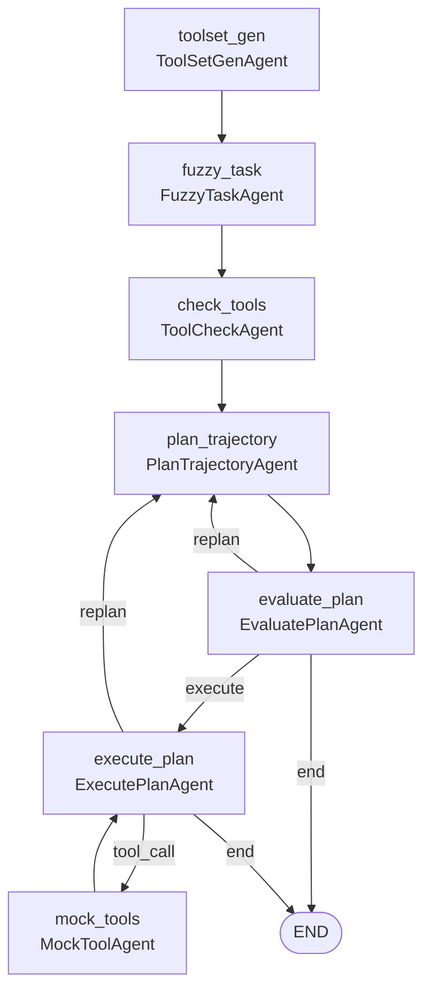
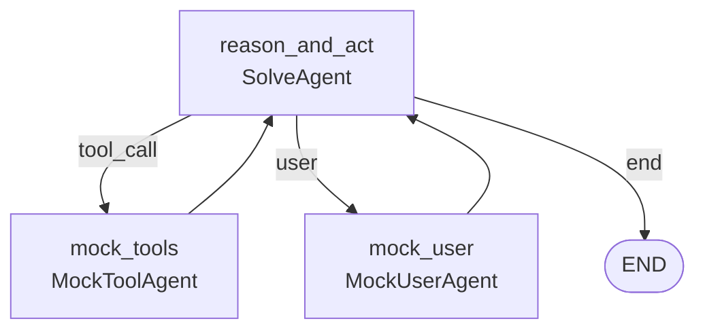

# TraceSynth

TraceSynth 是一个面向 **Agentic RAG（智能体检索增强生成）** 的合成数据生成与评测框架。它基于 LangGraph 编排多智能体流水线，从监督 QA 种子出发，自动设计虚拟 RAG 工具集、构造评测任务、规划并执行工具调用轨迹，最终产出可用于训练或评测 Agentic RAG 系统的多轮工具调用数据。

整个框架由三个命令行入口串联而成：

| 入口脚本 | 作用 | 底层流水线 |
|----------|------|------------|
| [`scripts/tool_use_data_gen.py`](scripts/tool_use_data_gen.py) | **数据合成**：种子 QA → 工具集 → 任务 → 规划-执行轨迹 | `graph_virtual_tools.py`（Plan-Execute） |
| [`scripts/solve_task.py`](scripts/solve_task.py) | **轨迹复采样**：对已合成任务重复求解，生成多条候选轨迹 | `graph_solve_task.py`（Reason-Act） |
| [`scripts/rubrics.py`](scripts/rubrics.py) | **评分细则生成**：对比多条轨迹、生成 rubrics 并选出最佳解 | `RubricsAgent`（单次 LLM 对比） |

典型工作流：`tool_use_data_gen.py`（生成任务与首条轨迹）→ `solve_task.py`（为同一任务补采更多轨迹）→ `rubrics.py`（对比轨迹、生成评测细则、挑选最佳解）。

## 核心能力

- **6 步 Agentic RAG 流程对齐**：覆盖检索前优化 → 检索 → 检索后优化 → 相关性评估与迭代 → 最终回答
- **规划-执行范式**：先由 Planner 生成高层子目标计划，经 Evaluator 校验后再逐步执行，可在执行中触发重规划
- **多智能体协作**：工具设计、任务模糊化、工具审核、规划、评估、执行、工具模拟、用户模拟分工明确
- **可配置复杂度**：工具数量、自定义组件、干扰工具、检索迭代轮次均可调节
- **三层容错**：API 退避重试、LLM 输出解析重采样、非法 tool_call 自纠错
- **并发批处理**：支持 JSONL / HuggingFace datasets 多源输入，断点续跑
- **best-of-N 评测闭环**：复采样 + rubrics 对比，自动筛选最佳轨迹

## Agentic RAG 六步流程

除 step1（用户 Query）和 step6（最终输出）外，step2~step5 每一步均抽象为可调用工具：

| 步骤 | 名称 | 工具类别 | 示例 |
|------|------|----------|------|
| step1 | 用户 Query 输入 | — | 接收原始检索/问答请求 |
| step2 | 检索前优化 | Query_Optimization_Tools | Query 重写、HyDE、Step-back |
| step3 | 检索 | Retrieval_Tools | BM25、向量检索、知识图谱 |
| step4 | 检索后优化 | Post_Retrieval_Tools | 去重、融合、Rerank、精炼（合并为一步） |
| step5 | 相关性评估与迭代 | Evaluation_Tools | 完备性判断、缺口诊断；不足则返回 step2 |
| step6 | 输出最终结果 | — | 基于检索上下文生成 `<answer>` |

---

## 入口一：数据合成 `tool_use_data_gen.py`

主入口。读取监督 QA 种子，运行完整的 Plan-Execute 流水线，产出带工具调用轨迹的合成数据。

### 流水线架构



| 节点 | Agent | 职责 |
|------|-------|------|
| `toolset_gen` | `ToolSetGenAgent` | 根据种子 QA 设计 RAG 工具集、任务、约束（restrict）与管道流程 |
| `fuzzy_task` | `FuzzyTaskAgent` | 将任务模糊化为用户口吻的 Query + 背景知识 |
| `check_tools` | `ToolCheckAgent` | 审核/精简工具集，按需添加干扰工具 |
| `plan_trajectory` | `PlanTrajectoryAgent` | 生成高层子目标计划（high-level workflow） |
| `evaluate_plan` | `EvaluatePlanAgent` | 校验计划合理性，决定执行 / 重规划 / 终止 |
| `execute_plan` | `ExecutePlanAgent` | 按计划逐步执行工具调用，输出最终 `<answer>` |
| `mock_tools` | `MockToolAgent` | 模拟虚拟知识库中的工具返回 |

> `PlanTrajectoryAgent` / `EvaluatePlanAgent` / `ExecutePlanAgent` 若未在 yaml 中显式配置，会自动回退到 `FallbackModel` 的模型参数。

### 运行

```bash
python scripts/tool_use_data_gen.py --config configs/tool_use_data_gen.yaml
```

CLI 可临时覆盖合成复杂度（优先级高于 yaml）：

```bash
python scripts/tool_use_data_gen.py \
  --num-tools "4~6" \
  --num-custom-tools "1" \
  --distractor-tools "1~2" \
  --max-iterations "1~2"
```

运行时会额外把当前流水线图导出到 `architecture.png`。

---

## 入口二：轨迹复采样 `solve_task.py`

对**已合成**的任务清单重复求解，为每个任务生成多条候选轨迹（`solution*.json`），供 best-of-N 与 rubrics 对比使用。它只需要任务的 `fuzzy_task` 与 `checked_tools`，不再重新设计工具集。

与主入口不同，该入口走的是 **Reason-Act 循环**（`graph_solve_task.py`），并引入用户模拟：



| 节点 | Agent | 职责 |
|------|-------|------|
| `reason_and_act` | `SolveAgent` | 按 6 步流程边推理边发起工具调用 / 询问用户 |
| `mock_tools` | `MockToolAgent` | 模拟虚拟知识库中的工具返回 |
| `mock_user` | `MockUserAgent` | 模拟真实用户，逐步透露背景信息 |

### 运行

```bash
# 先从示例复制出实际配置
cp configs/solve_task.example.yaml configs/solve_task.yaml

python scripts/solve_task.py --config configs/solve_task.yaml
```

- 输入为 `paths.data_file` 指向的合成清单（默认 `output/virtual_tool_use.jsonl`）。
- `logging.repeat_times` 控制每个任务补采的轨迹条数；新轨迹以 `solutionN.json` 递增写入对应任务目录。
- 若任务目录已存在 `rubrics_output.json`，则跳过（视为评测已完成）。

---

## 入口三：评分细则生成 `rubrics.py`

扫描 `paths.solution_path` 下每个任务目录，对其中 `solution*.json`（需 ≥2 条）做对比评测，产出评估细则与最佳解选择。

单次 LLM 调用（`RubricsAgent`）依次输出并解析以下 XML 区块：

- `<alignment_check>`：轨迹与规划 workflow 的对齐性判断（KEEP / DISCARD）
- `<reasoning>`：对保留轨迹的比较分析
- `<rubrics>`：评分细则（策略合规 / 子目标完成 / 必要用户交互）
- `<final>`：定性结论
- `<best_solution>`：最佳解文件名

结果写入各任务目录下的 `rubrics_output.json`；已处理任务记录在 `logging.already_processed_path`。

### 运行

```bash
# 先从示例复制出实际配置
cp configs/rubrics.example.yaml configs/rubrics.yaml

python scripts/rubrics.py
```

> 注意：`rubrics.py` 固定读取 `configs/rubrics.yaml`，**不接受 `--config` 参数**。

---

## 项目结构

```
TraceSynth/
├── configs/
│   ├── tool_use_data_gen.yaml           # 主入口配置
│   ├── tool_use_data_gen.example.yaml
│   ├── solve_task.example.yaml          # 复采样入口配置（示例）
│   └── rubrics.example.yaml             # 评分细则入口配置（示例）
├── scripts/
│   ├── tool_use_data_gen.py             # 入口一：数据合成
│   ├── solve_task.py                    # 入口二：轨迹复采样
│   └── rubrics.py                       # 入口三：评分细则生成
├── tracesynth/
│   ├── configuration.py                 # 模型配置 & 合成复杂度（SynthesisComplexity）
│   ├── functions/
│   │   ├── prompt.py                    # 全部提示词模板
│   │   ├── call_llms.py                 # LLM 调用 & API 退避重试
│   │   ├── tool_set_gen.py              # 工具集生成
│   │   ├── fuzzy_task.py                # 模糊任务生成
│   │   ├── tool_check.py                # 工具审核
│   │   ├── solve_task.py                # 单步求解
│   │   ├── mock_tools.py                # 工具模拟
│   │   └── mock_user.py                 # 用户模拟
│   ├── graph/
│   │   ├── graph_virtual_tools.py       # Plan-Execute 流水线（入口一）
│   │   └── graph_solve_task.py          # Reason-Act 复采样流水线（入口二）
│   └── io/
│       └── samples.py                   # 输入 schema、归一化、JSONL/failed 记录读写
├── tests/                               # 单元/冒烟测试
├── data/                               # 种子 QA 数据
└── output/                             # 默认输出目录
```

## 快速开始

### 1. 安装依赖

```bash
pip install -r requirements.txt
```

### 2. 配置 API 密钥

在项目根目录创建 `.env` 或 `.local.env`，填入所用模型对应的 API Key：

```env
DASHSCOPE_API_KEY=your_key
SILICONFLOW_API_KEY=your_key
WANLAI_API_KEY=your_key
AGNES_API_KEY=your_key
```

密钥通过配置文件中 `step_models` 各步骤的 `api_key_env` 字段引用**环境变量名**（**不要**将密钥字面量写入 yaml）。

### 3. 准备种子数据

监督 QA 种子默认使用 [`data/seed_qa_sample.jsonl`](data/seed_qa_sample.jsonl)，每行一条 JSON：

```json
{
  "id": "rag-001",
  "question": "在进行创业投资时，如何确定一个项目的估值？",
  "label": "项目估值通常综合可比公司法、DCF 和最近融资轮估值等因素。",
  "context": "创业投资估值需结合行业可比标的、未来现金流预测与退出路径。"
}
```

**字段约定**

| 字段 | 必填 | 说明 |
|------|------|------|
| `question` | 是 | 规范问题字段；`query` 可作为别名 |
| `label` | 是 | 金标答案，用于约束虚拟知识库与答案校验，不暴露给 Solver |
| `context` | 否 | 参考上下文，可为字符串或字符串列表 |
| `id` | 建议 | 唯一标识；缺失时由 `question+label` 生成稳定 hash |

也支持 HuggingFace `datasets` 目录作为 `paths.data_file`；字段映射可在 yaml 的 `input` 段配置。

> **Legacy**：旧版 `persona_*.jsonl`（仅 `persona` 文本）已不再作为默认输入。如需兼容，可设置 `input.legacy_persona_mode: true`（会将 persona 同时作为 question 与 label，仅用于过渡）。

### 4. 运行

参见上文各入口的「运行」小节。

## 配置说明

主配置文件 [`configs/tool_use_data_gen.yaml`](configs/tool_use_data_gen.yaml) 包含以下区块（路径均相对配置文件所在目录解析）：

### step_models — 各步骤模型

为各 Agent 节点分别指定模型、API 地址、密钥环境变量、温度、max_tokens：

```yaml
step_models:
  ToolSetGenAgent:
    name: "qwen3.7-max"
    api_base: "https://dashscope.aliyuncs.com/compatible-mode/v1"
    api_key_env: "DASHSCOPE_API_KEY"
    max_tokens: 10240
    temperature: 0.9
    use_thinking: false
  # FuzzyTaskAgent, ToolCheckAgent,
  # PlanTrajectoryAgent, EvaluatePlanAgent, ExecutePlanAgent,
  # MockToolAgent, MockUserAgent, FallbackModel ...
```

`FallbackModel` 为规划/评估/执行三个 Agent 的兜底模型：这三者未显式配置时自动使用它。

### synthesis — 合成复杂度（4 个参数）

| 参数 | 位置 | 默认值 | 说明 |
|------|------|--------|------|
| `num_tools` | `task_complexity` | `"4~6"` | RAG 工具总数（须 ≥4 以覆盖 step2~step5） |
| `num_custom_tools` | `task_complexity` | `"1"` | 自定义虚拟组件数 |
| `distractor_tools` | `task_complexity` | `"1~2"` | ToolCheck 阶段添加的干扰工具数 |
| `max_iterations` | `iteration_complexity` | `"1~2"` | step5→step2 检索迭代轮次（`"0"` 表示无需迭代） |

数值支持范围写法（`"4~6"` / `"4-6"`）或单值（`"4"`）。

### retry — 容错重试

| 参数 | 默认值 | 说明 |
|------|--------|------|
| `api_max_retries` | `3` | API 瞬时错误（超时/限流/5xx）总尝试次数（含首次调用） |
| `api_retry_base` | `1.0` | 指数退避基数（秒） |
| `parse_max_retries` | `2` | 输出解析失败后的额外重采样次数；解析总次数为 `parse_max_retries + 1` |
| `tool_call_max_retries` | `3` | 非法 `tool_call` 自纠错次数 |

> 默认配置下，一次 `call_and_parse` 最坏情况会发起 `api_max_retries * (parse_max_retries + 1) = 3 * (2 + 1) = 9` 次底层 API 请求。

### processing — 批处理与执行上限

```yaml
processing:
  max_workers: 1            # 并发线程数
  max_tasks: 1              # 单次运行最大任务数（null 表示不限）
  retry_failed_tasks: true  # 是否重跑此前失败的任务
  max_solver_turns: 18      # 单任务执行阶段最大轮次
  graph_recursion_limit: 60 # LangGraph 递归上限
```

### input — 输入字段映射

```yaml
input:
  question_fields: ["question", "query"]
  label_fields: ["label", "answer", "gold"]
  context_field: "context"
  id_field: "id"
  dataset_split: "test"
  legacy_persona_mode: false
```

### evaluation — 答案校验

```yaml
evaluation:
  skip_label_match: false   # true 则跳过答案与 label 的一致性校验
  use_label_as_answer: true
```

### logging / paths — 输入输出路径

```yaml
logging:
  task_file_path: "../output/virtual_tool_use.jsonl"
  failed_task_file_path: "../output/virtual_tool_use.failed.jsonl"
  solve_path: "../output/solve_tool_use/"
paths:
  data_file: "../data/seed_qa_sample.jsonl"
```

## 输出格式

成功任务写入 `output/virtual_tool_use.jsonl`，每条记录示例：

```json
{
  "id": "rag-001",
  "question": "...",
  "label": "...",
  "context_present": true,
  "fuzzy_task": "...",
  "checked_tools": [],
  "plan": [],
  "plan_evaluation": {},
  "artifact_dir": "output/solve_tool_use/rag-001",
  "predicted_answer": "...",
  "label_match_status": "match",
  "match_score": 1.0,
  "solution_file": "solution1.json"
}
```

每个任务的详细产物保存在 `output/solve_tool_use/<id>/`：

| 文件 | 内容 |
|------|------|
| `solution1.json` … | 完整对话轨迹（含 system/user/assistant 消息，不含金标泄露） |
| `tool_call_history.json` | 虚拟工具调用历史（含虚拟知识库状态变更） |
| `more_info.json` | `question/label/context`、任务背景、约束、规划/评估、执行步骤、答案校验、合成复杂度参数 |
| `failed_state.json` / `failed_solution.json` | 失败时的完整状态快照与部分轨迹（仅失败任务） |
| `rubrics_output.json` | 评分细则与最佳解选择（由 `rubrics.py` 生成） |

- 答案与 `label` 不一致的样本会写入 `output/virtual_tool_use.failed.jsonl`（可通过 `evaluation.skip_label_match: true` 跳过校验）。
- 入口报错的任务也会追加失败摘要到该 `.failed.jsonl`。

## 容错机制

TraceSynth 内置三层防护，降低 LLM 格式抖动和网络瞬时错误导致的任务失败率：

1. **API 层**：对超时、连接错误、429、5xx 做指数退避重试（[`call_llms.py`](tracesynth/functions/call_llms.py)）
2. **解析层**：标签/JSON 解析失败时自动重采样 LLM 输出（`call_and_parse`）
3. **求解层**：非法 `tool_call` 不立即终止，而是追加纠错提示让模型自我修正（[`graph_virtual_tools.py`](tracesynth/graph/graph_virtual_tools.py)）

此外，规划阶段的 `evaluate_plan` 支持在计划不合理时回退重规划（受 `max_plan_revisions` 约束），执行阶段超过 `max_solver_turns` 或触发 LangGraph 递归上限时会安全落盘失败状态。

## 测试

```bash
# 输入 schema 与归一化测试
python tests/test_samples.py

# 提示词占位符冒烟测试
python tests/test_6step_prompts.py

# 重试机制单元测试
python tests/test_retry_resilience.py
```

## 开发说明

- 统一输入 schema 与 JSONL 读取在 [`tracesynth/io/samples.py`](tracesynth/io/samples.py)
- 提示词模板集中在 [`tracesynth/functions/prompt.py`](tracesynth/functions/prompt.py)
- 合成复杂度定义在 [`tracesynth/configuration.py`](tracesynth/configuration.py) 的 `SynthesisComplexity` 类
- Plan-Execute 流水线在 [`tracesynth/graph/graph_virtual_tools.py`](tracesynth/graph/graph_virtual_tools.py)，Reason-Act 复采样在 [`tracesynth/graph/graph_solve_task.py`](tracesynth/graph/graph_solve_task.py)
- 新增 Agent 节点时需在 yaml `step_models` 中注册，并在 `create_step_config` 中透传配置

## License

内部项目，使用前请确认相关 API 服务条款与数据使用政策。
